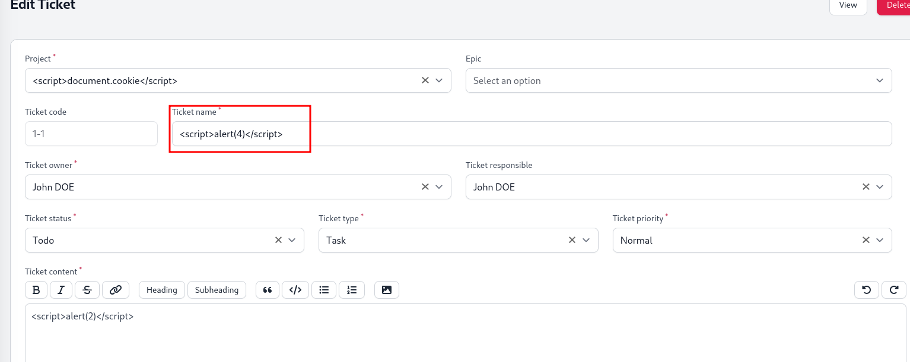
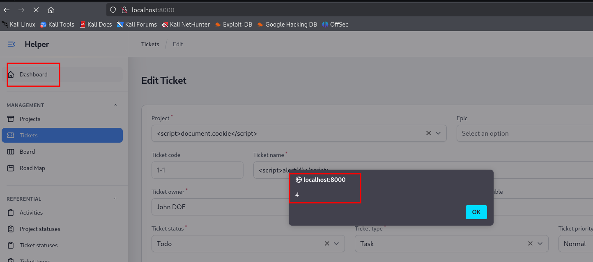

# Exploit Title: Project Management - Stored XSS
# Google Dork: N/A
# Date: 29.07.2025
# Exploit Author: Iulian Schifirnet
# Vendor Homepage: https://devaslanphp.github.io/project-management/
# Software Link: https://github.com/devaslanphp/project-management/releases
# Version: 1.2.4
# CVE : CVE-2025-52203

## Description:
---------------
A stored cross-site scripting (XSS) vulnerability exists in DevaslanPHP project-management v1.2.4. The vulnerability resides in the Ticket Name field, which fails to properly sanitize user-supplied input. An authenticated attacker can inject malicious JavaScript payloads into this field. When a legitimate user logs in is redirected automatically to the Dashboard panel where the malicious script automatically executes in the user's browser context.

## Impact:
---------------
Stored XSS execution in legitimate user sessions

## Payload:
---------------

## Proof of Vulnerability:
---------------
This is where we create the ticket and inject the malicious JavaScript payload:

And once we go to the Dashboard or we log in the JavaScript payload will trigger:

## Credits
---------------
Vulnerability discovered by Iulian Schifirnet.