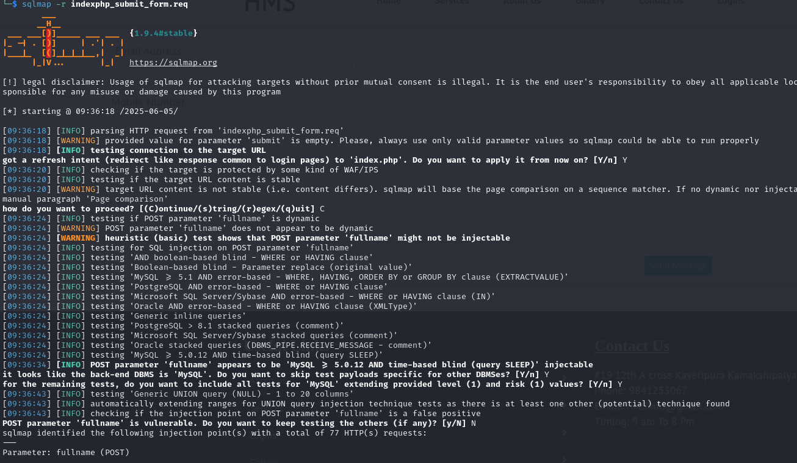
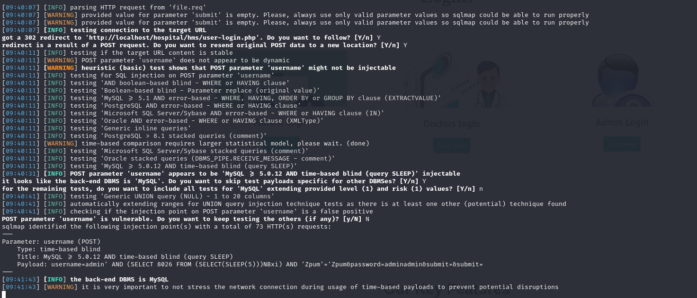

# Exploit Title: Hospital Management System - Unauthenticated SQL Injection
# Google Dork: N/A
# Date: 26.09.2025
# Exploit Author: Iulian Schifirnet
# Vendor Homepage: https://github.com/Karthikg1908/Hospital-Management-System
# Software Link: https://github.com/Karthikg1908/Hospital-Management-System
# Version: 1.0
# CVE : CVE-2025-57254

## Description:
---------------
An SQL injection vulnerability in user-login.php and index.php of Karthikg1908 Hospital Management System (HMS) 1.0 allows remote attackers to execute arbitrary SQL queries via the username and password POST parameters. The application fails to properly sanitize input before embedding it into SQL queries, leading to unauthorized access or potential data breaches. This can result in privilege escalation, account takeover, or exposure of sensitive medical data.

## Impact:
---------------
Unauthenticated SQL Injection on different endpoints leading to privilege escalation, account takeover, or exposure of sensitive medical data.

## Impacted Endpoint - index.php:
---------------
```php

<?php
include_once('hms/include/config.php');
if(isset($_POST['submit']))
{
$name=$_POST['fullname'];
$email=$_POST['emailid'];
$mobileno=$_POST['mobileno'];
$dscrption=$_POST['description'];
$query=mysqli_query($con,"insert into tblcontactus(fullname,email,contactno,message) value('$name','$email','$mobileno','$dscrption')");
echo "<script>alert('Your information succesfully submitted');</script>";
echo "<script>window.location.href ='index.php'</script>";

} ?>
<!doctype html>
<html lang="en">

<head>
    <meta charset="utf-8">
    <meta name="viewport" content="width=device-width, initial-scale=1, shrink-to-fit=no">
    <title> Hospital management System </title>

    <link rel="shortcut icon" href="assets/images/fav.jpg">
    <link rel="stylesheet" href="assets/css/bootstrap.min.css">
    <link rel="stylesheet" href="assets/css/fontawsom-all.min.css">
     <link rel="stylesheet" href="assets/css/animate.css">
    <link rel="stylesheet" type="text/css" href="assets/css/style.css" />
</head>

    <body>
```

### Proof of Vulnerability:
---------------
This is where we create the ticket and inject the malicious JavaScript payload:


## Impacted Endpoint - user-login.php:
---------------
```php
<?php
session_start();
error_reporting(0);
include("include/config.php");
if(isset($_POST['submit']))
{
$puname=$_POST['username'];
$ppwd=md5($_POST['password']);
$ret=mysqli_query($con,"SELECT * FROM users WHERE email='$puname' and password='$ppwd'");
$num=mysqli_fetch_array($ret);
if($num>0)
{
$_SESSION['login']=$_POST['username'];
$_SESSION['id']=$num['id'];
$pid=$num['id'];
$host=$_SERVER['HTTP_HOST'];
$uip=$_SERVER['REMOTE_ADDR'];
$status=1;
// For stroing log if user login successfull
$log=mysqli_query($con,"insert into userlog(uid,username,userip,status) values('$pid','$puname','$uip','$status')");
header("location:dashboard.php");
}
else
{
// For stroing log if user login unsuccessfull
$_SESSION['login']=$_POST['username'];
$uip=$_SERVER['REMOTE_ADDR'];
$status=0;
mysqli_query($con,"insert into userlog(username,userip,status) values('$puname','$uip','$status')");
$_SESSION['errmsg']="Invalid username or password";

header("location:user-login.php");
}
}
?>
```

### Proof of Vulnerability:
---------------
This is where we create the ticket and inject the malicious JavaScript payload:


## Credits
---------------
Vulnerability discovered by Iulian Schifirnet.